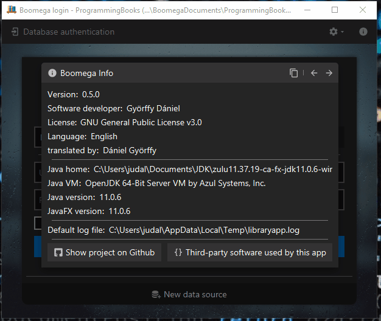

  
  <h1 align="center">Boomega</h1>

    
    
    

<h3 align="center">An advanced book explorer/catalog application written in Java and Kotlin.</h3>

<table style="width: 100%; border: none;">
<tr>
<td>
    
</td>

<td>
    
</td>
</tr>
</table>

## Features
* Cross-platform
* Multiple databases
* Quick file launch support  
* Importing from Google Books
* Dark/Light theme, modern UI
* Localization into multiple languages
* Plugin support
* Easy transportation between databases
* Multiple record-types like "Book" and "Magazine"
* Customizable key-bindings
* ...and more!

## Download

### Platform support
|                    | Windows           | Linux   | MacOS
| ---                |   ---             | ---     | ---   
| Installer (64-bit) |  **exe**, **msi** | _Planned_ | _Help wanted_
| Portable (64-bit)  |  **zip**          | _Planned_ | _Help wanted_ 
|Jar                 | ✔                 | ✔         | ✔ 

Jump to [releases](https://github.com/Dansoftowner/Boomega/releases).

> Note: These binaries are bundled with the [Azul Zulu OpenJDK Runtime](https://www.azul.com/downloads/zulu-community/?package=jdk) 

## Documentation
<!---
TODO: adding website/docs link
-->
The detailed documentation is available [here]().

## Source code

The repo has two important branches:
* `master` - for stable versions
* `dev` - for developing the app further

The code is written in `Java` and `Kotlin` mixed.
The GUI toolkit used is `JavaFX`. 
The app targets `Java 11+` but the code is `unmodularized`. 
The build tool used for this project is `Gradle`.

The recommended IDE is `IntelliJ Idea`.

### Build requirements
* JDK 11+ with JavaFX binaries ([Zulu](https://www.azul.com/downloads/zulu-community/?package=jdk-fx) or [Liberica](https://bell-sw.com/pages/libericajdk/) recommended) 

## Used libraries
* [Jump to list](USED_LIBRARIES.md)
* ...or you can view them in the `Boomega Info`: 

## License
This software is licensed under the [GNU General Public License v3](https://en.wikipedia.org/wiki/GNU_General_Public_License).