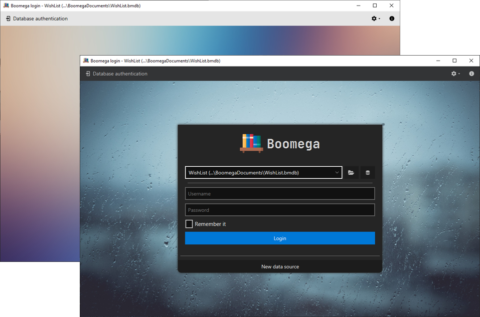

  
  <h1 align="center">Boomega</h1>

    
    
    

<h3 align="center">An advanced book explorer/catalog application written in Java and Kotlin.</h3>

<table style="width: 100%; border: none;">
<tr>
<td>
    
</td>

<td>
    
</td>
</tr>
</table>

## Features
* Cross-platform
* Multiple databases
* Quick file launch support  
* Importing from Google Books
* Dark/Light theme, modern UI
* Localization into multiple languages
* Plugin support
* Easy transportation between databases
* Multiple record-types like "Book" and "Magazine"
* Customizable key-bindings
* ...and more!

## Download

<table>

<tr>
  <td style="text-align: center">
        
        <b><label>Windows (7 or later) 64-bit</label></b>
  </td>

  <td style="text-align: center"> 
      
      <b><label>Linux 64-bit</label></b>
  </td>

  <td style="text-align: center">
      
      <b><label>MacOS 64-bit</label></b>
  </td>

</tr>

<tr>

  <td>

   <ul>
        <li><a href="https://github.com/Dansoftowner/Boomega/releases/download/v0.6.0/Boomega_0.6.0-win.exe">Exe installer (.exe)</a></li>
        <li><a href="https://github.com/Dansoftowner/Boomega/releases/download/v0.6.0/Boomega_0.6.0-win.msi">MSI installer package (.msi)</a></li>
        <li><a href="https://github.com/Dansoftowner/Boomega/releases/download/v0.6.0/Boomega_0.6.0-win.zip">Zip archive (.zip)</a></li>
   </ul>

  </td>

  <td>

   <ul>
        <li><a href="https://github.com/Dansoftowner/Boomega/releases/download/v0.6.0/boomega_0.6.0-1_amd64.deb">Debian Software Package (.deb)</a></li>
        <li><a href="https://github.com/Dansoftowner/Boomega/releases/download/v0.6.0/Boomega_0.6.0-linux.tar.xz">Tar.xz archive (.tar.xz)</a></li>
   </ul>

  </td>

  <td>

  
<i>Help wanted</i>

  </td>

</tr>
</table>

Jump to [releases](https://github.com/Dansoftowner/Boomega/releases).  
Or [build it yourself](#build)

## Documentation
<!---
TODO: adding website/docs link
-->
The detailed documentation is available [here]().

## Source code

* The repo has two important branches:
    * `master` - for stable versions
    * `dev` - for developing the app further
* The code is written in `Java` and `Kotlin` mixed.
* The GUI toolkit used is [JavaFX](https://openjfx.io/)
* The app targets `Java 16+` but the code is `unmodularized`
* The build tool used for this project is `Gradle`

## Build
The recommended IDE for building this project is `IntelliJ Idea`.

### Build requirements
* JDK 16+ with JavaFX binaries ([Zulu](https://www.azul.com/downloads/zulu-community/?package=jdk-fx) or [Liberica](https://bell-sw.com/pages/libericajdk/) recommended)

### Build manually (without using an IDE)
If you want to run the project, simply use `gradlew run`.  
To build a fat jar, use `gradlew shadowJar`.  
To build executable binaries, use `gradlew jpackage` ([more info here](distribution/DISTRIBUTION_GUIDELINE.md))

## Used libraries
* [Jump to list](USED_LIBRARIES.md)
* ...or you can view them in the `Boomega Info`: 

## License
This software is licensed under the [GNU General Public License v3](https://en.wikipedia.org/wiki/GNU_General_Public_License).