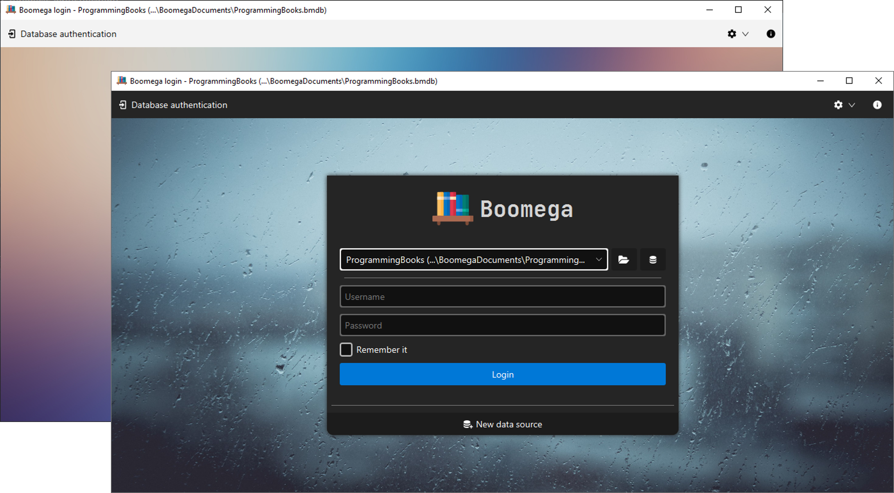

  
  <h1 align="center">Boomega</h1>

    
    
    
    

<h3 align="center">An advanced book explorer/catalog application written in Java and Kotlin.</h3>

<table style="width: 100%; border: none;">
<tr>
<td>
    
</td>

<td>
    
</td>
</tr>
</table>

## Features

* Cross-platform
* Dark/Light theme, modern UI
* Multiple languages
* Multiple database support
* Easy transportation between databases
* Multiple record-types like "Book" and "Magazine"
* Custom notes with Markdown support
* Importing from Google Books
* Customizable key-bindings
* Plugin support
* ...and more!

## Documentation

The detailed user guide is available [here](USER_GUIDE.md).

## Download

<table>

<tr>
  <td align="center">
        <b>
          <h1>
            
            Windows
          </h1>
        </b>
        
<b>(64-bit)</b>

  </td>

  <td align="center"> 
      <b>
          <h1>
            
            Linux
          </h1>
        </b>
      
<b>(64-bit)</b>

  </td>

  <td align="center">
        <b>
          <h1>
            
            MacOS 
          </h1>
        </b>
        
<b>(64-bit)</b>

  </td>

</tr>

<tr>

  <td>

<b>

  <ul>
      <li>
        <h4>
           <a href="https://github.com/Dansoftowner/Boomega/releases/download/v0.7.0/Boomega-0.7.0-win.exe">Exe installer (.exe)</a>
        </h4>
      </li>
      <li>
          <h4>
            <a href="https://github.com/Dansoftowner/Boomega/releases/download/v0.7.0/Boomega-0.7.0-win.msi">MSI installer package (.msi)</a>
          </h4>
      </li>
      <li>
        <h4>
           <a href="https://github.com/Dansoftowner/Boomega/releases/download/v0.7.0/Boomega-0.7.0-win.zip">Portable (.zip)</a>
        </h4>
      </li>
  </ul>

</b>
  </td>

  <td>
<b>
   <ul>
        <li>
          <h4>
            <a href="https://github.com/Dansoftowner/Boomega/releases/download/v0.7.0/Boomega-0.7.0-1_amd64-linux.deb">Debian Software Package (.deb)</a>
          </h4>
        </li>
        <li>
          <h4>
             <a href="https://github.com/Dansoftowner/Boomega/releases/download/v0.7.0/Boomega-0.7.0-linux.tar.xz">Portable (.tar.xz)</a>
          </h4>
        </li>
   </ul>
</b>
  </td>

  <td>

  
<b><i>Help wanted</i></b>

  </td>

</tr>

<tr>

  <td align="center" colspan="3">
    <b><a href="https://github.com/Dansoftowner/Boomega/releases/download/v0.7.0/Boomega-0.7.0-all.jar">Java archive (.jar)</a></b>
  </td>

</tr>
</table>

## Source code

* The repo has two important branches:
  * `master` - for stable versions
  * `dev` - for developing the app further
* The code is written in `Java` and `Kotlin` mixed.
* The GUI toolkit used is [JavaFX](https://openjfx.io/)
* The app targets `Java 16+` but the code is `unmodularized`
* The build tool used for this project is [Gradle](https://gradle.org/)
* _Want to contribute?_ See the [contribution guideline](CONTRIBUTING.md).

## Build
The recommended IDE for building this project is `IntelliJ Idea`.

### Build requirements
* JDK 16+ with JavaFX binaries ([Zulu](https://www.azul.com/downloads/zulu-community/?package=jdk-fx) or [Liberica](https://bell-sw.com/pages/libericajdk/) recommended)

### Build manually (without using an IDE)
If you want to run the project, simply use `gradlew run`.  
To build a fat jar, use `gradlew shadowJar`.  
To build executable binaries, use `gradlew jpackage` ([see distribution guideline](distribution/DISTRIBUTION_GUIDELINE.md))

## Used third-party libraries
* [Jump to list](USED_LIBRARIES.md)
* ...or you can view them in the `Boomega Info`: 
  

## License
This software is licensed under the [GNU General Public License v3](https://en.wikipedia.org/wiki/GNU_General_Public_License).