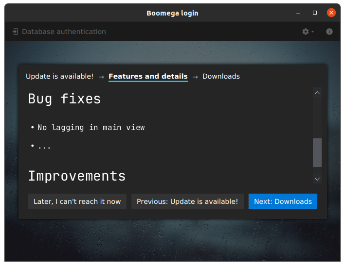
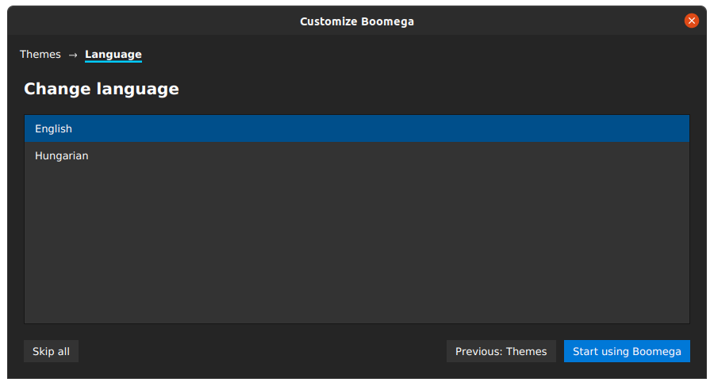
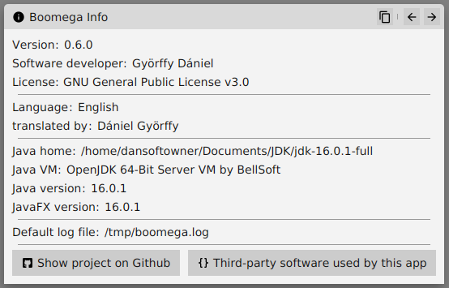

# Boomega User Guide

#### List of contents

* [Overview](#overview)
* [Getting Boomega](#getting-boomega)
    * [Platform support](#platform-support)
    * [Running it as a JAR](#running-it-as-a-jar)
    * [Updates](#updates)
* [Using Boomega](#using-boomega)
  * [Database files](#database-files)
  * [Run Boomega for the first time](#running-boomega-for-the-first-time)
  * [Login view](#login-view)
  * [Opening existing database](#opening-existing-database)
  * [Creating database](#creating-database) 
  * [Database manager](#database-manager) 
  *
  *
  * [Key Bindings](#key-bindings)
  * [User interface themes](#user-interface-themes)
  * [User interface language](#user-interface-languages)
  *
  * [Viewing Boomega info](#viewing-boomega-info)
    

## Overview

Boomega is an open-source book explorer/catalog application.
Can be used for searching books on online services (e.g. [Google Books](https://books.google.com/googlebooks/about/index.html))
and for registering/saving books to local database files.


## Getting Boomega

**You can download Boomega [here](README.md#download) or from the [releases](https://github.com/Dansoftowner/Boomega/releases) page.**

### Platform support

Boomega can run as a native application on the given platforms:

#### Windows 7, 8, 8.1, 10

Available binaries:
* **MSI Installer package (.msi)** (recommended)
* **Exe installer (.exe)**
* **Portable (.zip)**

#### Linux

Available binaries:
* **Debian Software package (.deb)** - for Debian based systems
* **Portable (.tar.xz)**

#### MacOS

MacOS-specific binaries are currently not available (help wanted), but you can still run the app [as a jar](#running-it-as-a-jar)

### Running it as a jar

You can run the cross-platform jar file with a **Java 16+** 
runtime that has JavaFX binaries bundled inside it (e.g a custom runtime built with `jlink`, [Zulu](https://www.azul.com/downloads/zulu-community/?package=jdk-fx) \ [Liberica](https://bell-sw.com/pages/libericajdk/)) or you have to 
put the javafx modules to the `module-path` (see: [openjfx docs](https://openjfx.io/openjfx-docs/#install-javafx)).

You also have to pass the [necessary JVM options](JVM_OPTIONS.md) when you invoke `java` in the command line/terminal.  

Example:
```
java --add-exports javafx.base/com.sun.javafx=ALL-UNNAMED   --add-exports javafx.base/com.sun.javafx.runtime=ALL-UNNAMED --add-exports javafx.graphics/com.sun.javafx.application=ALL-UNNAMED --add-exports javafx.base/com.sun.javafx=ALL-UNNAMED --add-exports javafx.controls/com.sun.javafx.scene.control.skin.resources=ALL-UNNAMED --add-exports javafx.graphics/com.sun.javafx.scene=ALL-UNNAMED  --add-exports javafx.graphics/com.sun.glass.ui=ALL-UNNAMED --add-exports javafx.graphics/com.sun.javafx.text=ALL-UNNAMED  --add-exports javafx.graphics/com.sun.javafx.scene.text=ALL-UNNAMED  --add-exports javafx.graphics/com.sun.javafx.geom=ALL-UNNAMED --add-opens java.base/java.io=ALL-UNNAMED --add-opens javafx.graphics/javafx.scene.text=ALL-UNNAMED  --add-opens javafx.graphics/com.sun.javafx.text=ALL-UNNAMED -jar Boomega_x.x.x-all.jar
```

#### Parameters

If you want to launch a database file, you can pass the file location as a program argument:

```
java <VM Options> -jar Boomega_x.x.x-all.jar "<Path To your File>"
```

For more information, see [Database files](#database-files).

### Updates

By default, Boomega is configured to check for updates automatically and notify you when a new version is available.
You will be allowed to download the binary you want immediately.

> Note: you can configure the update-searching settings at `Preferences/Settings (Ctrl+Alt+S) -> Updates`

<table>
<tr>

<td>

</td>

<td>

</td>

<td>

</td>

</tr>
</table>

## Using Boomega

### Database files

Boomega stores your saved books into a particular Boomega (`.bmdb`) database file.
A `Boomega Database` can be secured with username & password pair, but it can be an open-database accessible for everyone.

You can create `bmdb` files any time you want (see: [Creating database](#creating-database)) and **open existing ones** (see: [Opening existing database](#opening-existing-database)).

If Boomega is installed by an installation file as a native application, the `.bmdb` files are associated with 
the app, so you can launch them from your file explorer too.

You can have multiple database files opened at the same time in the app.

### Running Boomega for the first time

When Boomega runs for the first time, it will show a customization/configuration dialog.

#### 1. Select the user interface theme

Select whether you want to use the **light**, **dark** or **os-synchronized** theme.


For more information, see [user interface themes](#user-interface-themes).

#### 2. Select the default language

Select your preferred language from the available language list.



For more information, see [user interface languages](#user-interface-languages).

### Login view

TODO

### Opening existing database

TODO

### Creating database

TODO

### Database manager

TODO

### Key bindings

TODO

### User interface themes

TODO

### User interface languages

TODO

### Viewing Boomega info

You can view all the information about your Boomega release in the `Boomega info` dialog:



You can copy all this data to the clipboard by clicking on the top-right copy icon.

This dialog can be launched by clicking on the top-right info icon in the [login view](#login-view) 
or by clicking on the `File > Help > About` item in the [database view](#database-view).