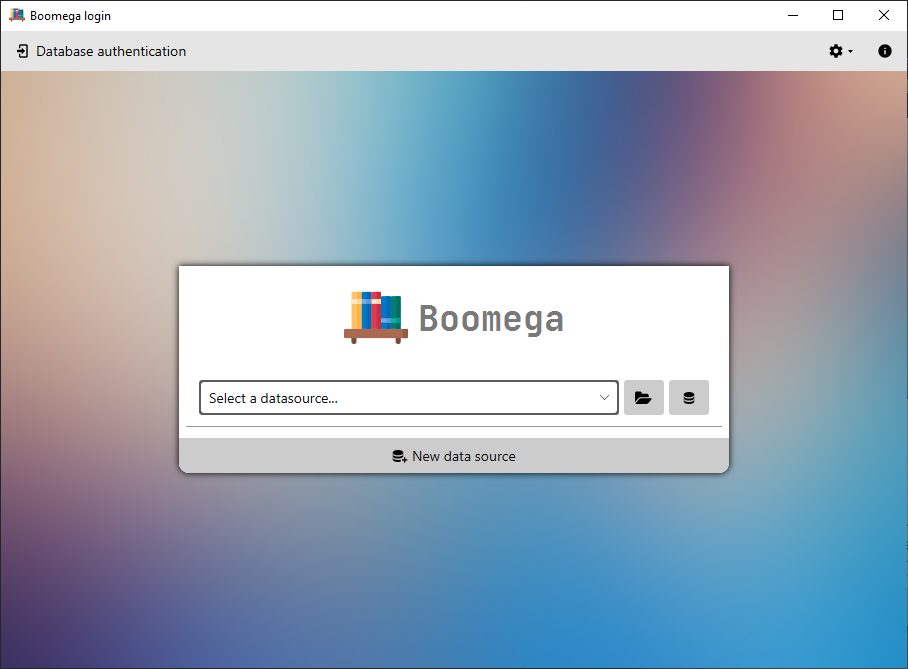

# Boomega User Guide

> At this point the user guide is incomplete and not reliable!

#### List of contents

* [Overview](#overview)
* [Getting Boomega](#getting-boomega)
    * [Platform support](#platform-support)
    * [Running it as a JAR](#running-it-as-a-jar)
    * [Updates](#updates)
* [Using Boomega](#using-boomega)
  * [Database files](#database-files)
  * [Run Boomega for the first time](#running-boomega-for-the-first-time)
  * [Login view](#login-view)
  * [Opening existing database](#opening-existing-database)
  * [Creating database](#creating-database) 
  * [Database manager](#database-manager) 
  * [Preferences dialog](#preferences-dialog)
  * [Key Bindings](#key-bindings)
  * [User interface themes](#user-interface-themes)
  * [User interface language](#user-interface-languages)
  * [Plugin Manager](#plugin-manager)
  * [Viewing Boomega info](#viewing-boomega-info)
    

## Overview

Boomega is an open-source book explorer/catalog application.
Can be used for searching books on online services (e.g. [Google Books](https://books.google.com/googlebooks/about/index.html))
and for registering/saving books to local database files.


## Getting Boomega

**You can download Boomega [here](README.md#download) or from the [releases](https://github.com/Dansoftowner/Boomega/releases) page.**

### Platform support

Boomega can run as a native application on the given platforms:

#### Windows 7, 8, 8.1, 10

Available binaries:
* **MSI Installer package (.msi)** (recommended)
* **Exe installer (.exe)**
* **Portable (.zip)**

#### Linux

Available binaries:
* **Debian Software package (.deb)** - for Debian based systems
* **Portable (.tar.xz)**

#### MacOS

MacOS-specific binaries are currently not available (help wanted), but you can still run the app [as a jar](#running-it-as-a-jar)

### Running it as a jar

You can run the cross-platform jar file with a **Java 16+** 
runtime that has JavaFX binaries bundled inside it (e.g a custom runtime built with `jlink`, [Zulu](https://www.azul.com/downloads/zulu-community/?package=jdk-fx) \ [Liberica](https://bell-sw.com/pages/libericajdk/)) or you have to 
put the javafx modules to the `module-path` (see: [openjfx docs](https://openjfx.io/openjfx-docs/#install-javafx)).

You also have to pass the [necessary JVM options](JVM_OPTIONS.md) when you invoke `java` in the command line/terminal.  

Example:
```
java --add-exports javafx.base/com.sun.javafx=ALL-UNNAMED   --add-exports javafx.base/com.sun.javafx.runtime=ALL-UNNAMED --add-exports javafx.graphics/com.sun.javafx.application=ALL-UNNAMED --add-exports javafx.base/com.sun.javafx=ALL-UNNAMED --add-exports javafx.controls/com.sun.javafx.scene.control.skin.resources=ALL-UNNAMED --add-exports javafx.graphics/com.sun.javafx.scene=ALL-UNNAMED  --add-exports javafx.graphics/com.sun.glass.ui=ALL-UNNAMED --add-exports javafx.graphics/com.sun.javafx.text=ALL-UNNAMED  --add-exports javafx.graphics/com.sun.javafx.scene.text=ALL-UNNAMED  --add-exports javafx.graphics/com.sun.javafx.geom=ALL-UNNAMED --add-opens java.base/java.io=ALL-UNNAMED --add-opens javafx.graphics/javafx.scene.text=ALL-UNNAMED  --add-opens javafx.graphics/com.sun.javafx.text=ALL-UNNAMED -jar Boomega_x.x.x-all.jar
```

#### Parameters

If you want to launch a database file, you can pass the file location as a program argument:

```
java <VM Options> -jar Boomega_x.x.x-all.jar "<Path To your File>"
```

For more information, see [Database files](#database-files).

### Updates

By default, Boomega is configured to check for updates automatically and notify you when a new version is available.
You will be allowed to download the binary you want immediately.

> Note: you can configure the update-searching settings at `Preferences/Settings (Ctrl+Alt+S) -> Updates`

<table>
<tr>

<td>

</td>

<td>

</td>

<td>

</td>

</tr>
</table>

## Using Boomega

### Database files

Boomega stores your saved records/books into a particular Boomega (`.bmdb`) database file.
A `Boomega Database` can be secured with credentials (username & password), or it can be an open-database accessible for everyone.

> Note: multiple users per database are not supported!

You can create `bmdb` files any time you want (see: [Creating database](#creating-database)) and **open existing ones** (see: [Opening existing database](#opening-existing-database)).

If Boomega is installed by an installation file as a native application, the `.bmdb` files are associated with 
the app, so you can launch them from your file explorer too.

You can have multiple database files opened at the same time in the app.

### Running Boomega for the first time

When Boomega runs for the first time, it will show a customization/configuration dialog.

#### 1. Select the user interface theme

Select whether you want to use the **light**, **dark** or **os-synchronized** theme.


Read more about user interface themes [here](#user-interface-themes).

#### 2. Select the default language

Select your preferred language from the available language list.


Read more about user interface languages [here](#user-interface-languages).

### Login view

The first important `view` you'll see is the `login view`. 
Here, you are able to enter into a particular database, and you can access some
basic tools/functions the app provides like: [Opening existing databases](#opening-existing-database),
[Creating database](#creating-database), [Database manager](#database-manager) and the [Preferences dialog](#preferences-dialog).



#### The top toolbar (on the top)

- By clicking on the  icon, you can view the [Boomega info](#viewing-boomega-info).
- You can access the `quick menu` by clicking on the  icon:  
    
  Here you are able to:
    - Search for software updates
    - Open the plugin manager (read more about the Plugin Manager [here](#plugin-manager))
    - Open the application settings (see [Preferences dialog](#preferences-dialog))

#### The login box (in the center)


- By clicking on the  icon you can open the [Database manager](#database-manager)
- By clicking on the  icon you can open an existing database from your file-system
  (see [Opening existing database](#opening-existing-database))
- By clicking on the  icon on the bottom you can create a new database (see [Creating database](#creating-database))

If you created/opened some database files, you can choose a data source in the combo-box:


After you selected a database, you can specify the credentials and sign in into the database:


If you check the `remember it` box before you log in to the database, the next time you launch the app, the program
will log in to that database automatically.


> Note: if you did not add authentication for the particular database, you can just click the login
> button without typing the username & password.

### Opening existing database

TODO

### Creating database

TODO

### Database manager

TODO

### Preferences dialog

TODO

### Key bindings

TODO

### User interface themes

TODO

### User interface languages

TODO

### Plugin Manager

TODO

### Viewing Boomega info

If you would like to know some basic info of your application like what version you use,
you can view all the information about your Boomega release in the `Boomega info` dialog:


- **Version** - the current version you use
- **Software developer**
- **License**  
- **Language**  
- **Java home** - the path to the Java Runtime Environment the app is running on
- **Java VM** - the name and the vendor of the Java Virtual Machine
- **Java version** - the version of the Java environment
- **Default log file** - the path to the log file

You can copy all this data to the clipboard by clicking on the  icon.

This dialog can be launched by clicking on the top-right  icon in the [login view](#login-view) 
or by clicking on the `File > Help > About` item in the [database view](#database-view).